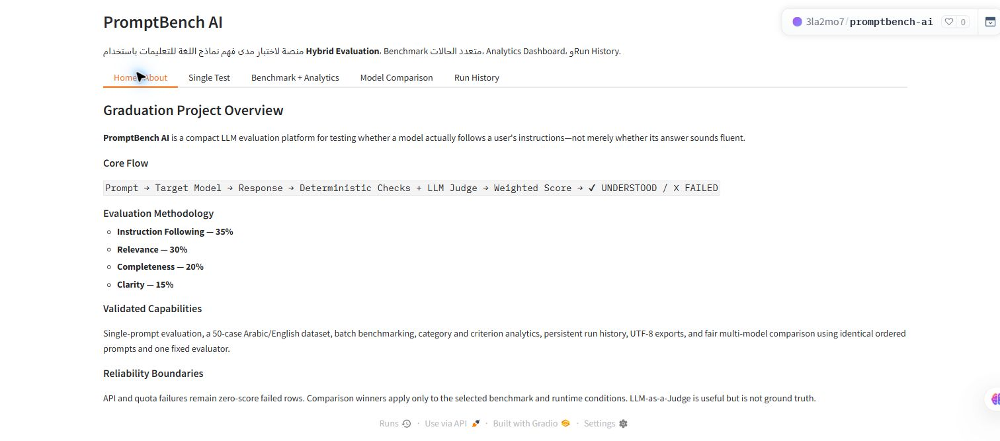

# PromptBench AI

[](https://github.com/Alaamo7/promptbench-ai/actions/workflows/ci.yml)

PromptBench AI is a Gradio application for testing how well a language model follows a prompt. It combines deterministic rule checks with an LLM judge, produces weighted criterion scores, and supports single tests, batch benchmarks, analytics, run history, and same-case multi-model comparisons.

## Live demo

[Open the Hugging Face Space](https://huggingface.co/spaces/3la2mo7/promptbench-ai)

The Space may need a short wake-up period when its status is `Sleeping`.



## Purpose

Fluent output is not the same as instruction compliance. This project provides a reproducible workflow for checking format and content constraints, scoring four evaluation criteria, and preserving failures instead of silently dropping them from benchmark summaries.

## Verified features

- Gradio 6.25.0 interface with Home, Single Test, Benchmark + Analytics, Model Comparison, and Run History tabs.
- Hugging Face Inference Providers through `huggingface_hub.InferenceClient`.
- Optional local Ollama backend through its `/api/chat` endpoint.
- Deterministic checks for sentence count, bullet count, maximum words, JSON validity, required terms, and forbidden terms.
- LLM-as-a-Judge evaluation for instruction following, relevance, completeness, and clarity.
- Weighted score (35%, 30%, 20%, 15%), configurable pass threshold, binary verdict, and quality band.
- A validated 50-case Arabic/English JSON dataset.
- Batch filtering, CSV/JSON export, category/criterion analytics, local JSONL run history, and 2–4 model comparison.
- Offline unit and functional tests that use fakes/mocks instead of paid API calls.

This repository does **not** implement an autonomous agent loop, user authentication, a database server, fine-tuning, or model training.

## Architecture

```text
User
  |
  v
Gradio UI (app.py)
  |
  +--> ModelClient --> Hugging Face Inference API or Ollama --> Target response
  |                                                        |
  |                                                        v
  +--> Deterministic validators + LLM judge --> Weighted score/verdict
                                                           |
                                                           v
                                    UI + CSV/JSON export + local JSONL history
```

See [Architecture](docs/architecture.md) for the component and data-flow details.
The evidence classification used by this portfolio is recorded in [Source Audit](docs/source-audit.md).

## Project structure

```text
.
├── app.py                    # Gradio entry point and UI event handlers
├── src/                      # clients, validators, evaluation, benchmark and reporting
├── data/test_prompts.json    # 50-case bilingual benchmark dataset
├── scripts/                  # connectivity and offline smoke utilities
├── tests/                    # offline tests; integration tests are opt-in
├── docs/                     # architecture, security, deployment and validation
├── requirements.txt
├── .env.example
└── .github/workflows/ci.yml
```

Generated `outputs/` and `data/history/*.jsonl` are intentionally ignored.

## Installation

Python is not pinned by the Hugging Face repository. The mirrored source was validated locally with Python 3.12.13.

```bash
python -m venv .venv
source .venv/bin/activate      # Windows: .venv\Scripts\activate
python -m pip install -r requirements.txt
cp .env.example .env           # Windows: copy .env.example .env
python app.py
```

Set `MODEL_BACKEND=ollama` for a local Ollama server, or keep `huggingface` and provide an `HF_TOKEN` through the environment. Never commit `.env`.

## Environment variables

Only names and safe defaults belong in `.env.example`:

- `HF_TOKEN` — required when `MODEL_BACKEND=huggingface`.
- `MODEL_BACKEND` — `huggingface` or `ollama`.
- `HF_PROVIDER`
- `OLLAMA_BASE_URL`
- `TARGET_MODEL`
- `EVALUATOR_MODEL`
- `APP_TITLE`
- `PASS_THRESHOLD`
- `REQUEST_TIMEOUT`
- `BENCHMARK_DELAY_SECONDS`

## Testing

Run offline validation without external credentials:

```bash
python -m compileall -q app.py src tests
python -m pytest -m "not integration" -q
python -m pip check
```

The integration marker is reserved for live provider checks and is not executed automatically. See [Validation](docs/validation.md) for recorded results and evidence boundaries.

## Security

- Secrets are loaded from environment variables or Hugging Face Space Secrets.
- `.env`, credential JSON files, private keys, runtime history, and generated outputs are ignored.
- CI runs an offline hardcoded-secret pattern test and Gitleaks.
- A previously reported public Hugging Face secret alert means credential rotation remains required even though the current source is clean.

See [Security](docs/security.md).

## Deployment

The verified deployment uses a Gradio Hugging Face Space with `app.py` as the entry point and `requirements.txt` for dependencies. See [Deployment](docs/deployment.md) for update, rebuild, and rollback guidance.

## Known limitations

- LLM-as-a-Judge is not ground truth and can introduce evaluator bias.
- Results depend on model/provider availability, model revisions, selected cases, rate limits, and runtime conditions.
- Local JSONL history is not durable across all Space rebuilds and is not a multi-user database.
- The Space Python version is not pinned in the source metadata.
- Live API integration was not rerun during this GitHub mirror because no credential was used.
- The public Space was observed in `Sleeping` state during this audit.

## Roadmap

- Add an explicit Python runtime pin after validating it on Hugging Face Spaces.
- Add a versioned evaluation dataset and dataset provenance notes.
- Add opt-in live integration tests with bounded cost and timeout controls.
- Add durable storage only after defining privacy and retention requirements.
- Rotate the credential associated with the historical public secret alert.

## Portfolio context

This repository documents hands-on AI engineering work in Gradio application development, prompt evaluation, provider integration, deterministic validation, LLM judging, benchmarking, testing, secret hygiene, CI, deployment evidence, debugging, and limitation reporting. Claims are restricted to inspected source, executed offline tests, repository history, and genuine interface screenshots.

## License

[MIT](LICENSE)
